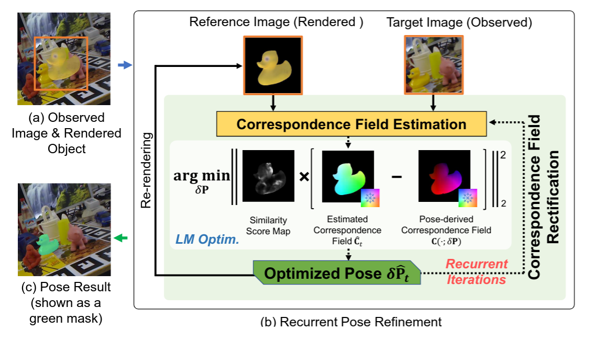
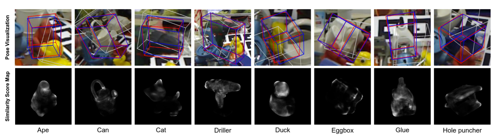

# RNNPose: Recurrent 6-DoF Object Pose Refinement with Robust Correspondence Field Estimation and Pose Optimization

[Yan Xu](https://decayale.github.io/), [Kwan-Yee Lin](https://kwanyeelin.github.io/), [Guofeng Zhang](http://www.cad.zju.edu.cn/home/gfzhang/), [Xiaogang Wang](https://www.ee.cuhk.edu.hk/en-gb/people/academic-staff/professors/prof-xiaogang-wang), [Hongsheng Li](http://www.ee.cuhk.edu.hk/~hsli/). 

*Conference on Computer Vision and Pattern Recognition (CVPR), 2022.*

[[Paper]](https://scholar.google.com/scholar?hl=zh-CN&as_sdt=0%2C5&q=RNNPose%3A+Recurrent+6-DoF+Object+Pose+Refinement+with+Robust+Correspondence+Field+Estimation+and+Pose+Optimization&btnG=)


## 1. Framework 
The basic pipeline of our proposed RNNPose.  (a) Before refinement, a reference image is rendered according to the object initial pose (shown in a fused view).
(b) Our RNN-based framework recurrently refines the object pose based on the estimated correspondence field between the reference and target images. The pose is optimized to be consistent with the reliable correspondence estimations highlighted by the similarity score map (built from learned 3D-2D descriptors) via differentiable LM optimization.  (c) The output refined pose.  

<!--  -->
<p align="center">

</p>

## 2. Pose Estimation with Occlusions and Erroneous Pose Initializations


### Estimated Poses and Intermediate System Outputs from Different Recurrent Iterations. 

<p align="center">
 
</p>


### Pose Estimates with Erroneous Pose Initializations
Visualization of our pose estimations (first row) on Occlusion LINEMOD dataset and the similarity score maps (second row) for downweighting unreliable correspondences during pose optimization. 
For pose visualization, the white boxes represent the erroneous initial poses, the red boxes are estimated by our algorithm and the ground-truth boxes are in blue. Here, the initial poses for pose refinement are originally from PVNet but added with significant disturbances for robustness testing. 
<center class="half">
   
</center>


## 3. Installation 
### Install the Docker 
A dockerfile is provided to help with the environment setup. 
You need to install [docker](https://docs.docker.com/get-docker/) and [nvidia-docker2](https://github.com/NVIDIA/nvidia-docker) first and then set up the docker image and start up a container with the following commands: 

```
cd RNNPose/docker
sudo docker build -t rnnpose .    
sudo docker run  -it  --runtime=nvidia --ipc=host  --volume="HOST_VOLUME_YOU_WANT_TO_MAP:DOCKER_VOLUME"  -e DISPLAY=$DISPLAY -e QT_X11_NO_MITSHM=1  rnnpose bash

```
If you are not familiar with [docker](https://docs.docker.com/get-docker/), you could also install the dependencies manually following the provided dockerfile.  

### Compile the Dependencies
```
cd RNNPose/scripts
bash compile_3rdparty.sh
```


## 4. Data Preparation
We follow [DeepIM](https://github.com/liyi14/mx-DeepIM) and [PVNet](https://github.com/zju3dv/pvnet-rendering) to preprocess the training data for LINEMOD. 
You could follow the steps [here](doc/prepare_data.md) for data preparation. 


## 5. Test with the Pretrained Models
We train our model with the mixture of the real data and the synthetic data on LINEMOD dataset. 
<!-- and evaluate the trained models on the test set of LINEMOD and LINEMOD OCCLUSION datasets.  -->
The trained models on the LINEMOD dataset have been uploaded to the [OneDrive](https://mycuhk-my.sharepoint.com/:u:/g/personal/1155139432_link_cuhk_edu_hk/ESPTVyUryHdGl65fRAxN51gBBayJJb9NpCqWA-tY2CFKJQ?e=R9bcLW). 
You can download them 
and put them into the directory *weight/* for testing. 


An example bash script is provided below for reference. 

```
export PYTHONPATH="$PROJECT_ROOT_PATH:$PYTHONPATH"
export PYTHONPATH="$PROJECT_ROOT_PATH/thirdparty:$PYTHONPATH"

seq=cat
gpu=1
start_gpu_id=0
mkdir $model_dir

train_file=/home/yxu/Projects/Works/RNNPose_release/tools/eval.py
config_path=/mnt/workspace/Works/RNNPose_release/config/linemod/"$seq"_fw0.5.yml
pretrain=$PROJECT_ROOT_PATH/weights/trained_models/"$seq".tckpt

python -u $train_file multi_proc_train  \
        --config_path $config_path \
        --model_dir $model_dir/results \
        --use_dist True \
        --dist_port 10000 \
        --gpus_per_node $gpu \
        --optim_eval True \
        --use_apex True \
        --world_size $gpu \
        --start_gpu_id $start_gpu_id \
        --pretrained_path $pretrain 

```

Note that you need to specify the PROJECT_ROOT_PATH, i.e. the absolute directory of the project folder *RNNPose* and modify the respective data paths in the configuration files to the locations of downloaded data before executing the commands. You could also refer to the commands below for evaluation with our provide scripts.

### Evaluation on LINEMOD
```
bash scripts/eval.sh 
```

### Evaluation on LINEMOD OCCLUSION
```
bash scripts/eval_lmocc.sh

```

## Training from Scratch
An example training script is provided. 
```
bash scripts/train.sh 
```


## 6. Citation
If you find our code useful, please cite our paper. 
```
@inproceedings{xu2022rnnpose,
  title={RNNPose: Recurrent 6-DoF Object Pose Refinement with Robust Correspondence Field Estimation and Pose Optimization},
  author={Xu, Yan and Kwan-Yee Lin and Zhang, Guofeng and Wang, Xiaogang and  Li, Hongsheng},
  booktitle={Proceedings of the IEEE/CVF Conference on Computer Vision and Pattern Recognition},
  year={2022}
}

@article{xu2024rnnpose,
  title={Rnnpose: 6-dof object pose estimation via recurrent correspondence field estimation and pose optimization},
  author={Xu, Yan and Lin, Kwan-Yee and Zhang, Guofeng and Wang, Xiaogang and Li, Hongsheng},
  journal={IEEE Transactions on Pattern Analysis and Machine Intelligence},
  year={2024},
  publisher={IEEE}
```


## 7. Acknowledgement

The skeleton of this code is borrowed from [RSLO](https://github.com/DecaYale/RSLO). We also would like to thank the public codebases [PVNet](https://github.com/zju3dv/pvnet), [RAFT](https://github.com/princeton-vl/RAFT), [SuperGlue](https://github.com/magicleap/SuperGluePretrainedNetwork) and [DeepV2D](https://github.com/princeton-vl/DeepV2D). 

<!-- ## TODO List and ETA
- [x] Inference code and pretrained models (25/12/2021)
- [ ] Training code
- [ ] Code cleaning and improvement -->


